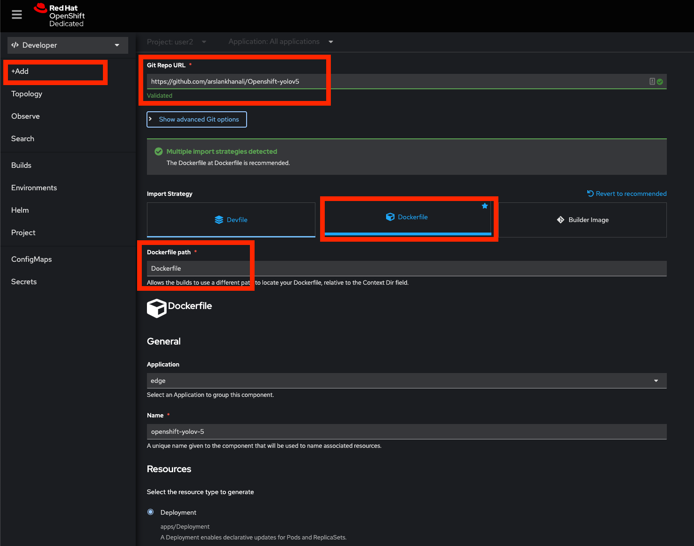

## App: Web UI
Simple app consisting of a form where you can upload an image, and see the inference result of the model in the browser. To run on openshift see diagram below:

<p align="center">

</p>

Port will be 6000

## App: API call

Expose port 5000 and append '/v1/object-detection/yolov5"' at the end of the url.   
You will have to manually create the service and expose the route.

Example of an API call via python
```bash
curl --location --request POST 'http://edge-containers-yolov-5-1-2-user2.apps.anomaly-cluster.rqdu.p1.openshiftapps.com/v1/object-detection/yolov5' \
--form 'image=@"/Users/arslankhan/Downloads/a1.jpg"'
```

```py
import requests

url = "http://edge-containers-yolov-5-1-2-user2.apps.anomaly-cluster.rqdu.p1.openshiftapps.com/v1/object-detection/yolov5"

payload={}
files=[
  ('image',('a1.jpg',open('/Users/arslankhan/Downloads/a1.jpg','rb'),'image/jpeg'))
]
headers = {
  'Cookie': 'b7c8a8d85d6695d874ebd2786816dd45=9f9930134df7c33d4dd53777d9c67443'
}

response = requests.request("POST", url, headers=headers, data=payload, files=files)

print(response.text)

```
The model inference results are returned:

```
[{'class': 0,
  'confidence': 0.8197850585,
  'name': 'person',
  'xmax': 1159.1403808594,
  'xmin': 750.912902832,
  'ymax': 711.2583007812,
  'ymin': 44.0350036621},
 {'class': 0,
  'confidence': 0.5667674541,
  'name': 'person',
  'xmax': 1065.5523681641,
  'xmin': 116.0448303223,
  'ymax': 713.8904418945,
  'ymin': 198.4603881836},
 {'class': 27,
  'confidence': 0.5661227107,
  'name': 'tie',
  'xmax': 516.7975463867,
  'xmin': 416.6880187988,
  'ymax': 717.0524902344,
  'ymin': 429.2020568848}]
```